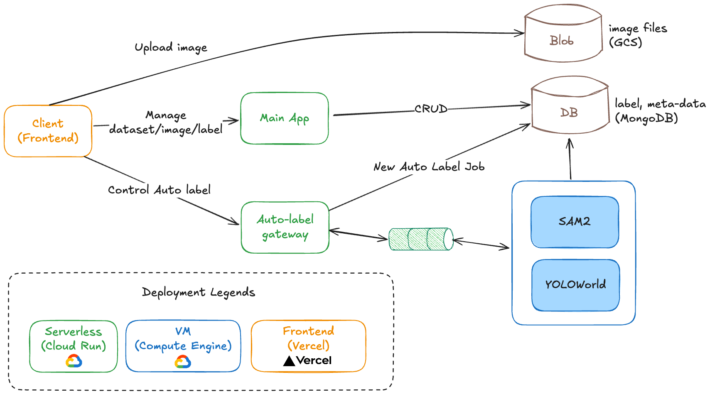

# Auto labeling app


- An exploratory project that supports labeling for object detection and segmentation datasets
- Leverages [SAM2](https://docs.ultralytics.com/models/sam-2/) and [YOLO-World](https://docs.ultralytics.com/models/yolo-world/) models to automatically generate bounding boxes and segmentation masks

> [!NOTE]
> This is an experimental project for learning purpose


## Features Demo


#### 🎥 Label bounding boxes with YOLO-world model assitance

https://github.com/user-attachments/assets/66f44b49-31a8-4f47-8d95-6082dc17a400

> [!TIP]
> Future Work: To reduce auto-labeling latency, consider implementing model warm-up or a caching strategy.


---

#### 🎥 Label bounding boxes with SAM2 model assitance

https://github.com/user-attachments/assets/dfbd2ff0-1757-432b-93ba-f565a8521869

---

#### 📸 Generate segmentation masks with SAM2


---


## System Architecture




**Tech stack**
- **Python** & **FastAPI**: Backend code and API
- **MongoDB**: NoSQL database for flexible data schema
- **GraphQL**: Flexible API query language
- **Docker**: Containerization for development and deployment
- **Ultralytics**: Support computer vision models
- **Google Cloud Platform**: Cloud infrastructure and services
- **GitHub Actions**: CD pipeline automation


## CD Pipeline
> Build image and deploy services to GCP

1. Build images and upload to registry 
    - Use [GitHub actions](.github/workflows) to build new images when corresponding changes are made
    - Upload image to GCP artifcat registry

2. Deploy
    - Backend app -> Serverless (Cloud Run)
    - Inference gateway -> Serverless (Cloud Run)
    - Inference services -> VM (Compute Engine)
        - Utilze [WatchTower](https://github.com/containrrr/watchtower/) for updating to the latest images.


---


## Getting Started (Local Development)

> Running locally, with GCS resources on the cloud

**1. Set up environment variables**

```sh
cp backend/app/.env.example backend/app/dev.env
# And fill in the env vars
```

**2. Set up credentials**

- Place the GCP service account JSON at `backend/app/gcp_service_account.json`
- Place the Clerk JWT Signed key at `backend/app/jwt_public.pem`

**3. Start Docker containers for backends**
```sh
docker-compose up
```

**4. Start frontend**
```sh
cd frontend/app
npm i
npm run dev
```


## Future Work
- Integrate YOLOWorld with SAM to support segmentation masks  
- Performance optimizations
  - Model warm-up or caching strategy to reduce inference latency
  - Pagination (since dataset might have a lot of images)
- Feature to export labeled datasets
